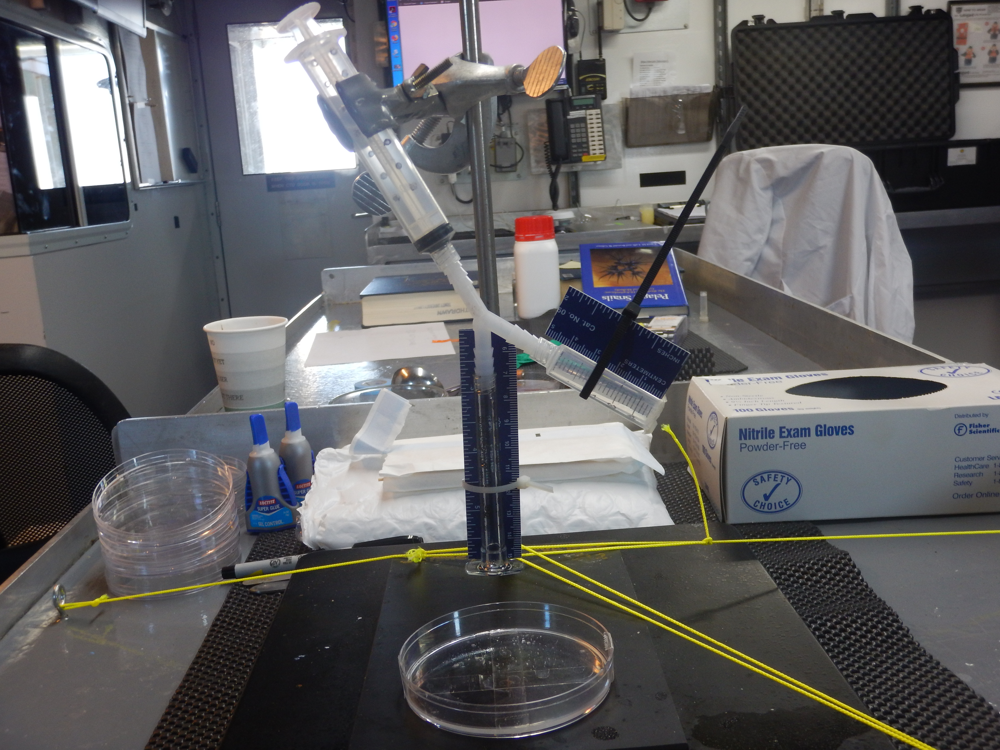

```{r setup, include=FALSE}
knitr::opts_chunk$set(echo = TRUE, fig.align="center")
```

## Motivation
Material property research helps to shed light on an organisms function given their form, or morphology. Understanding the dynamic structure of animal bodies help biologists to connect the two concepts together, ultimately to describe the diversity of both material properties and morphological diversity that exists. The measurement of material properties from biological organisms is limited to laboratory settings. However, organisms depend on certain conditions of ambient flow, temperature, pressure, and environmental factors that are not reflected when taken out of the field or during transit. For this reason, developing a portable field rheometer is one step closer to truly understanding the biomechanics of animal bodies and their biological function.

## Setup
The portable rheometer model we have made is pictured below:
!

## Calculations
Using the assumption that the jelly acts as an elastic constant, we are able to utilize Hooke's law,  

$F=-k*x$  

Understanding that this is not in one dimension, but rather two, the spring constant (k), is now the Youngs modulus (E) to represent the elastic modulus G'. You can relate this to the portable rheometer measurement because from the rubber standard you know the spring constant (k) because you know the material. Since you know the spring constant value, you are able to derive the deformation caused by the amount of force. The force is the same force used on the jelly. Then, you use the force and the change of deformation from the jelly to calculate the jelly's spring constant, also known as the elastic constant. The elastic constant relates to G' and G'' from rheology. Thus the derivation is, 

$F=-k*x$,  

$F1=-k1*\Delta x1$,  

$F1=F2$,  

$F2=-kx2*\Delta x2$,  

Now, saying that k2 represents the spring constant of the jelly,  

$k2=E2$,   

Where the spring constant is Young's modulus,  

$E2=Stress/Strain = (F/A)/(\Delta L/L) = 2G(1+v)$,  

Where v is the poisson ratio. We can make the assumption that this is ~ 0.5 or some other regularly accepted viscoelastic number. It is widely accepted that v ~ 1/2 for an incompressible object so that,  

$E2=Stress/Strain = (F/A)/(\Delta L/L) = 2G(1+v) = (3G)$,  

Where K is now the bulk modulus. The bulk modulus (K) is the volumetric elasticity and means it represents the tendency for an object to deform in all directions when uniformly loaded in all directions. The equation for this is,  
$Inverse of compressibility = Volumetric stress/Volumetric strain$  
and this allows us to use in in this context to apply it in this case because it is an extension of Young's modulus for 3 dimensions,  

$E2=(9KG)/(3K+G)$,  

Which allows us to derive G from the portable rheometer for further analysis.  
